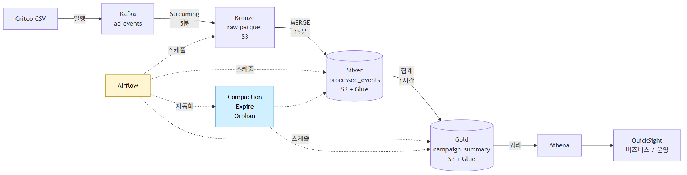

# ARCHITECTURE — 광고 캠페인 분석 + 운영 모니터링 플랫폼

> 살아있는 문서 — 진행하면서 갱신.
> 작성일: 2026-05-09 / 단계: 2단계 설계 1차 뼈대
> 가이드 §3의 12개 표준 섹션을 따름. 빈 항목은 `🔄 TBD`로 표기 — 단계 진행하며 채움.

---

## 1. 시스템 개요

광고 캠페인 매니저(P1 민혁)와 데이터 파이프라인 운영자(P2 지수)를 위한 단일 대시보드. Criteo Attribution 실데이터를 Kafka로 흘려 **Bronze → Silver → Gold 메달리온 3계층**으로 가공하고, **Iceberg가 늦게 도착하는 전환의 MERGE를 안전하게 처리**하는 것이 핵심. 비즈니스 면(캠페인 KPI)과 운영 면(파이프라인 헬스)을 한 대시보드의 두 탭에서 본다.

> 용어
> - **메달리온 아키텍처(Medallion)** = 데이터를 원본(Bronze) → 정제(Silver) → 집계(Gold) 3단계로 점진 가공하는 패턴
> - **MERGE** = "이미 있으면 갱신, 없으면 추가"하는 SQL 명령
> - **Iceberg** = 대용량 표를 안전하게 변경(MERGE/시간여행/스냅샷)할 수 있게 해주는 표 형식

---

## 2. 전체 아키텍처 다이어그램



> 원본: [docs/diagrams/architecture.mmd](diagrams/architecture.mmd)
> PNG 생성: `mmdc -i docs/diagrams/architecture.mmd -o docs/img/architecture.png -w 1600 -H 900` (자세한 내용은 [diagrams/README.md](diagrams/README.md))

🔄 **TBD**: PNG 파일 실 생성은 5단계 구현 시작 시점에 한 번 실행. 현재는 `.mmd` 원본만 존재.

---

## 3. 컴포넌트 / 인프라 구성

| 계층 | 도구 | 버전 | 역할 |
|---|---|---|---|
| 데이터 소스 | Criteo Attribution CSV | 16.4M rows / 30일 | 실제 광고 이벤트 |
| 발행 | `kafka_producer.py` (custom) | repo 내 | CSV → Kafka 발행 |
| 메시지 큐 | Apache Kafka (single broker) | 3.7 | 이벤트 스트리밍 |
| 스트리밍 처리 | Apache Spark Structured Streaming (Local Mode) | 3.5.3 | Kafka → Bronze 적재 |
| Bronze 저장 | Parquet append 파일 | snappy | 원본 보존 |
| Silver/Gold 표 형식 | Apache Iceberg | 1.6.x | MERGE / 스냅샷 / 시간여행 |
| 카탈로그 | AWS Glue Data Catalog | - | 매니지드, 비용 거의 0 |
| 객체 스토리지 | AWS S3 (ap-northeast-2) | - | Iceberg 데이터 + 메타 |
| 매니지먼트 | Iceberg Compaction / Expire / Orphan | Spark procedure | 자동 청소 |
| 오케스트레이션 | Apache Airflow (Docker, LocalExecutor) | 2.9 | DAG 스케줄·재시도·알림 |
| 쿼리 엔진 | AWS Athena (Iceberg 네이티브) | engine v3 | SQL 조회 |
| BI | AWS QuickSight (Standard Edition) | - | 대시보드 (탭 2개) |
| 컨테이너 | Docker / docker-compose | - | 로컬 환경 |
| 언어 | Python | 3.10+ | 글루 코드, 잡, DAG |

---

## 4. 데이터 흐름 (End-to-End)

```
Criteo CSV
  → kafka_producer.py (호스트 Python)
  → Kafka topic ad-events (3 partition)
  → Spark Structured Streaming (Local Mode, 5분 micro-batch)
  → Bronze parquet (S3 s3://<bucket>/lakehouse/ads/raw/, raw_date/raw_hour 파티션) [ADR-008]
  → Spark Batch MERGE (15분 주기, 최근 7일 윈도우)
  → Silver Iceberg processed_events (S3 + Glue, event_date 파티션)
  → Spark Batch 집계 (1시간 주기, 최근 7일 rebuild)
  → Gold Iceberg campaign_summary_daily (S3 + Glue, summary_date 월 파티션)
  → Athena (SQL)
  → QuickSight (비즈니스 탭 / 운영 탭)

[병렬]
Airflow DAG
  ├─ ads_silver_merge_15min       (15분)
  ├─ ads_gold_summary_hourly      (1시간)
  ├─ ads_iceberg_compaction_daily (매일 03:00 KST)
  ├─ ads_iceberg_expire_daily     (매일 04:00 KST, 30일 초과)
  └─ ads_iceberg_orphan_weekly    (매주 일 05:00 KST)
```

---

## 5. 레이어별 데이터 형태

> 상세 컬럼·타입은 [docs/DATA_MODEL.md](DATA_MODEL.md) 참고. 여기서는 요약만.

### 🟫 Bronze — `raw_files` (Parquet, S3) — [ADR-008](adr/0008-bronze-on-s3.md)
- 위치: `s3://<bucket>/lakehouse/ads/raw/ad-events/raw_date=YYYY-MM-DD/raw_hour=HH/`
- 변환: 없음. Kafka payload 그대로 보존.
- 보존: 90일 (백필 안전 윈도우, 90일 후 Glacier transition 검토)
- 카탈로그: 미등록 (선택적). Spark에서 경로로 직접 read.

### 🥈 Silver — `iceberg.ads.processed_events` (S3 + Glue)
- 파티션: `event_date` (Iceberg hidden partitioning, 일 단위)
- MERGE 키: `event_id`
- 변환: JSON → 컬럼 분해, timestamp UTC 표준화, 이상치 마킹, late-arriving conversion 갱신

### 🥇 Gold — `iceberg.ads.campaign_summary_daily` (S3 + Glue)
- 파티션: `summary_date` (월 단위)
- 갱신: 1시간 주기, 최근 7일 rebuild
- PK: (`summary_date`, `campaign_id`)
- 메트릭: impressions, clicks, conversions(2가지 어트리뷰션), CTR, CVR, ROI, 평균 전환 지연

---

## 6. 저장소 / 경로 매트릭스

| 단계 | 작업 | 경로 |
|---|---|---|
| Kafka topic | 발행/소비 | `ad-events` (3 partition, replication 1) |
| streaming → Bronze | 쓰기 | `s3://<bucket>/lakehouse/ads/raw/ad-events/raw_date=.../raw_hour=.../` |
| streaming checkpoint | 쓰기 | `s3://<bucket>/lakehouse/ads/checkpoints/raw-ad-events/` |
| Bronze → Silver | 읽기 | `s3://<bucket>/lakehouse/ads/raw/ad-events/` (최근 7일) |
| Silver MERGE | 쓰기 | `s3://<bucket>/lakehouse/ads/processed_events/` |
| Silver → Gold | 읽기 | `iceberg.ads.processed_events` (최근 7일) |
| Gold rebuild | 쓰기 | `s3://<bucket>/lakehouse/ads/campaign_summary_daily/` |
| Glue Catalog DB | 등록 | `iceberg_ads_db` |
| QuickSight 데이터셋 | 읽기 | Athena → `iceberg_ads_db` |

🔄 **TBD**: `<bucket>` 실제 이름은 5단계 AWS 환경 셋업 시 확정 (`meta-ads-lakehouse-<random>` 후보).

---

## 7. 스케줄 / 오케스트레이션

| DAG 이름 | 주기 | 작업 | 의존성 |
|---|---|---|---|
| `ads_silver_merge_15min` | */15 * * * * | Bronze → Silver MERGE | 없음 (Bronze는 streaming이 채움) |
| `ads_gold_summary_hourly` | 5 * * * * (매시 5분) | Silver → Gold 7일 rebuild | `ads_silver_merge_15min` 최근 성공 |
| `ads_iceberg_compaction_daily` | 0 3 * * * (03:00 KST) | Silver/Gold 작은 파일 합치기 | `ads_silver_merge_15min` 일시 정지 |
| `ads_iceberg_expire_daily` | 0 4 * * * (04:00 KST) | 30일 초과 옛 스냅샷 제거 | compaction 완료 |
| `ads_iceberg_orphan_weekly` | 0 5 * * 0 (일 05:00 KST) | 고아 파일 청소 | expire 완료 |

> Spark Streaming(Kafka → Bronze)은 별도 detached 컨테이너로 항상 가동. Airflow DAG로 관리하지 않음.

🔄 **TBD**: 알림(on_failure_callback) Webhook URL은 5단계 셋업 시 확정.

---

## 8. 환경 변수 / 설정

| 변수 | 용도 | 예시 |
|---|---|---|
| `AWS_PROFILE` | AWS 자격 프로필 | `iceberg-lab` |
| `AWS_DEFAULT_REGION` | 리전 | `ap-northeast-2` |
| `S3_BUCKET` | Iceberg 데이터 버킷 | `meta-ads-lakehouse-xxxx` |
| `S3_PREFIX` | 버킷 내 prefix | `lakehouse/ads` |
| `KAFKA_BOOTSTRAP` | Kafka 브로커 주소 | `kafka:29092` |
| `KAFKA_TOPIC` | 토픽 이름 | `ad-events` |
| `ICEBERG_CATALOG` | 카탈로그 이름 | `glue_catalog` |
| `ICEBERG_DB` | DB 이름 | `iceberg_ads_db` |
| `WAREHOUSE_LOCAL` | 로컬 raw 저장 경로 | `/home/jovyan/warehouse` |
| `AIRFLOW_HOME` | Airflow 작업 루트 | `/opt/airflow` |
| `ALERT_WEBHOOK_URL` | DAG 실패 알림 | 🔄 TBD |

상세는 5단계에서 만들 `.env.example` 참고.

---

## 9. 비기능 요구사항 (NFR)

> [PRD §5](PRD.md)와 일치 — 변경 시 양쪽 동시 갱신.

| 항목 | 목표 |
|---|---|
| 가용성 SLA | 99.5% (월 다운타임 ≤ 3.6시간) |
| Kafka → Bronze 지연 | P95 1분 |
| Bronze → Silver MERGE | P95 15분 |
| Silver → Gold 집계 | P95 1시간 |
| 처리량 (평소 / 피크) | 12 / 30 events/s |
| 보존 (핫 / 콜드 / raw) | 7일 / 30일 / 90일 |
| RTO / RPO | 1시간 / 15분 |
| AWS 월 비용 상한 | 5만원 |
| PII | 없음 (Criteo 익명화) |

---

## 10. 주요 결정 + 트레이드오프 (상세는 ADR)

| ID | 결정 | 핵심 트레이드오프 | 본문 |
|---|---|---|---|
| ADR-001 | Bronze는 Iceberg가 아닌 Parquet | append-only면 충분, Iceberg 가치는 Silver+에서 큼 | 🔄 3단계 |
| ADR-002 | Silver/Gold는 Iceberg | late-arriving conversion MERGE 멱등성 본질 | 🔄 3단계 |
| ADR-003 | 카탈로그 = AWS Glue | 매니지드, 비용 거의 0, AWS 네이티브 | 🔄 3단계 |
| ADR-004 | Spark = Local Mode | 1GB/일이라 분산 불필요, 100x 시 EMR | 🔄 3단계 |
| ADR-005 | 오케스트레이션 = Airflow on Docker | 매니지먼트 자동화 표준, 발표 임팩트 | 🔄 3단계 |
| ADR-006 | BI = QuickSight | 1인 월 약 3.5만, 셋업 빠름 | 🔄 3단계 |
| ADR-008 | Bronze 위치를 로컬에서 S3로 이전 | 일관성·백업 ↑, 비용 +$2/월 | [작성됨](adr/0008-bronze-on-s3.md) |

---

## 11. 실행 순서 (Bootstrap)

🔄 **TBD** — 5단계 구현 끝나면 채움. 골격만 미리:

```
1) AWS 자격증명 export (AWS_PROFILE=iceberg-lab)
2) S3 버킷 생성 + Glue DB 생성
3) docker compose up -d --build         # spark-ads + airflow + kafka
4) python kafka_producer.py --csv ./data/ad_events_sample.csv --speed 500
5) Spark streaming detach 실행 (kafka_to_bronze.py, S3 출력)
6) Airflow UI에서 ads_silver_merge_15min DAG unpause
7) Athena에서 iceberg_ads_db.processed_events SELECT 확인
8) QuickSight 데이터셋 등록 + 대시보드 import
```

---

## 12. 알려진 제약 / 리스크 / 향후 계획

### 현재 제약
- **R1.** Criteo 라이센스 CC BY-NC-SA 4.0 — 비상업 한정. 발표·포트폴리오 OK
- **R2.** Criteo에 광고주(advertiser) 컬럼 없음 → 캠페인 단위 분석으로 한정
- **R3.** Local Spark — 일 1,000만 이벤트 넘으면 OOM 위험
- **R4.** Glue Catalog 단일 — 도메인 늘면 분리 필요
- **R5.** 1인 운영 — 새벽 호출 불가, RUNBOOK 단단히 + 알림 필터링 중요

### 100x 스케일 (일 1억 이벤트) 시 깨질 곳
- **Kafka**: 단일 브로커 → 다중 브로커 + 파티션 N배
- **Spark**: Local Mode → EMR Cluster Mode (코드는 그대로)
- **Bronze S3 비용**: 9TB × $0.023 = ~$200/월 → Glacier transition (90일 후) 정책 추가
- **S3 prefix throttling**: 단일 prefix 집중 시 → 도메인별 prefix 분리 (`raw/<advertiser_or_domain>/...`)
- **Iceberg 컴팩션**: 단일 잡 → 분산 매니지먼트 (`partial-progress.enabled`)
- **Glue Catalog**: 단일 → 도메인별 분리 또는 REST 카탈로그 이전

🔄 100x 시나리오 ADR(`docs/adr/0007-scale-out-100x.md`)은 5단계 구현 후 작성

### 향후 계획 (Won't 범위, Phase 2 후보)
- 봇 클릭 필터링 (Silver 단계 룰 기반)
- 백필 절차 자동화 스크립트
- 멀티 환경(dev/staging/prod) 분리

---

## 갱신 이력

- 2026-05-09 v1: 8개 섹션 초안 (가이드 구버전 기준)
- 2026-05-09 v2: 가이드 신버전 12개 섹션 표준에 맞춰 재작성. 다이어그램 PNG 분리.
- 🔄 v3 예정: PNG 실제 생성, ADR 본문 6건 작성 (3단계)
- 🔄 v4 예정: 실제 측정 처리량/지연/비용 반영 (구현 후)
